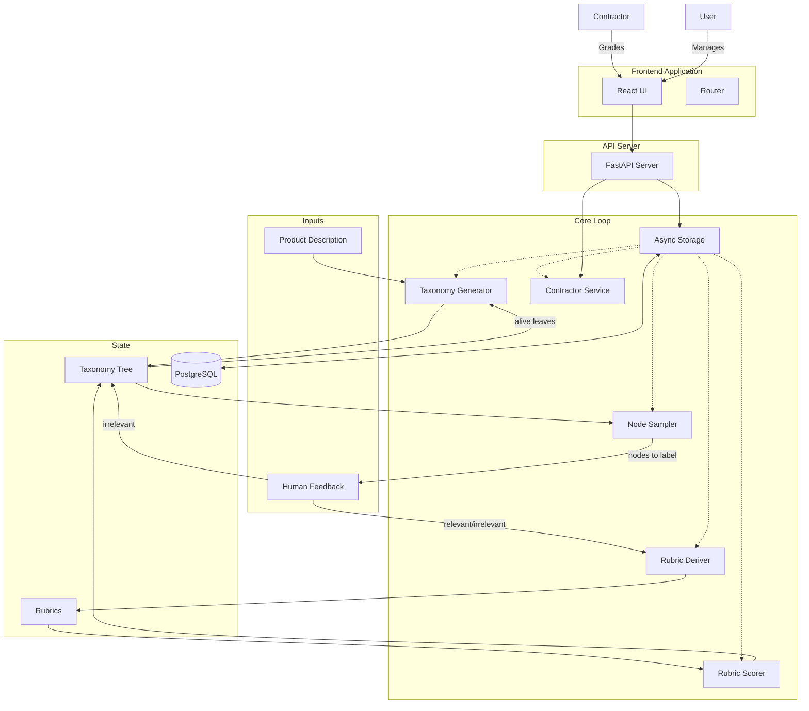
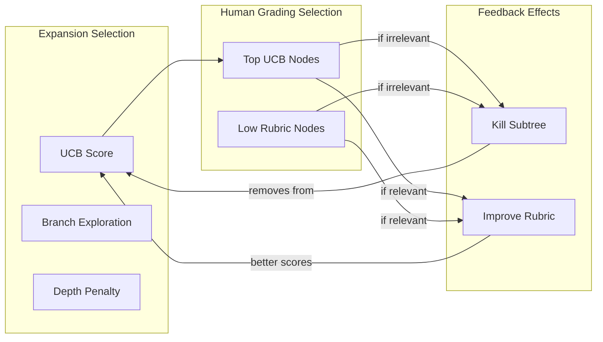

# Average-Case Testing

The system learns what makes a test case "relevant" by iteratively:

1. Generating test scenarios as a tree (taxonomy)
2. Sampling nodes for human labeling (relevant/irrelevant)
3. Pruning irrelevant subtrees
4. Deriving rubrics from human feedback to automate future scoring
5. Using rubric scores to guide where to expand the tree next

---

## Data Model

### TaxonomyNode

```python
class TaxonomyNode:
    id: str
    content: str  # The test scenario description
    children: List[TaxonomyNode]
    status: Enum  # ALIVE, KILLED, HUMAN_VERIFIED_RELEVANT
    rubric_score: float  # Predicted relevancy from rubrics
    human_label: Optional[bool]  # True=relevant, False=irrelevant, None=unlabeled
    created_iteration: int  # The iteration number when this node was created
    human_label: Optional[bool]  # True=relevant, False=irrelevant, None=unlabeled
```

### Rubric

```python
class Rubric:
    id: str  # Persistence ID
    principles: List[RubricPrinciple]
    iteration: int  # Version number
    metrics: RubricMetrics  # Linked metrics
```

### RubricMetrics

```python
class RubricMetrics:
    num_principles: int
    new_principles_count: int
    merged_principles_count: int
    avg_score: float
    score_variance: float
    score_alignment: float  # (avg_relevant_score - avg_irrelevant_score)
```

### Project

```python
class Project:
    id: str
    product_description: str
    taxonomy_root: TaxonomyNode
    rubrics: List[Rubric]
    human_labeled_samples: List[LabeledSample]
    new_branch_count: int
    total_expansions: int
```

### GradingQueueItem

```python
class GradingQueueItem:
    id: str
    project_id: str
    node_id: str
    status: Enum  # PENDING, ASSIGNED
    assigned_to: Optional[str]
    assigned_at: Optional[datetime]
```

---

## System Architecture



---

## Algorithm Flow (Detailed)

### Phase 1: Initialization

1. User provides **product description** (what it does, scope, etc.)
2. Generate initial taxonomy tree using LLM:
   - Input: product description
   - Output: root node with N initial topic branches
3. **Persist initial state** to database.

### Phase 2: Main Loop

**Step 1: Select nodes for human review** (uses Algorithm 2: UCB-Aligned Sampling)

- From all ALIVE leaf nodes, select K nodes:
- 50% from top UCB scores (validate expansion targets)
- 50% from low rubric scores (kill bad subtrees early)
- Skip already-labeled nodes

**Step 2: Collect human feedback**

- Present sampled nodes to human
- Human labels each as: RELEVANT or IRRELEVANT

**Step 3: Update tree based on feedback**

- For each IRRELEVANT node:
  - Mark node as KILLED
  - Propagate KILLED status to all DESCENDANTS (prune entire subtree below)
  - **Persist status changes** (efficiently using recursive CTE in DB)
  - Update branch statistics
- For each RELEVANT node:
  - Mark node as HUMAN_VERIFIED_RELEVANT
  - **Persist status changes**
  - NOTE: Children do NOT automatically become relevant (still need individual validation)
  - This node is confirmed good, but descendants may still be irrelevant

**Step 4: Derive/update rubrics**

- Input to LLM:
- Current rubrics (if any)
- All human-labeled samples with their labels
- Product description
- Output: Updated set of rubric principles
- Key: Rubrics should capture patterns that distinguish relevant from irrelevant
- **Persist new rubric** to database.

**Step 5: Re-score all alive nodes**

- Apply updated rubrics to score every ALIVE node
- **Persist scores** (update_scores_batch)
- Recompute UCB scores with updated rubric scores

**Step 6: Expand taxonomy** (uses Algorithm 1: Modified UCB)

- Select M alive leaf nodes using Modified UCB:
- `ucb_score = rubric + branch_exploration + node_exploration * depth_discount`
- For each selected node:
- Generate N children via LLM
- Initialize children with `visit_count = 0`, `depth = parent.depth + 1`
- Increment parent's `visit_count`
- **Persist new nodes** (save_nodes_batch)
- Update branch statistics

**Step 7: Repeat from Step 1**---

## Key Components to Implement

### 1. TaxonomyGenerator

- `generate_initial_tree(product_desc) -> TaxonomyNode`
- `expand_node(node, rubrics, product_desc) -> List[TaxonomyNode]`

### 2. ExpansionSelector (Algorithm 1: Modified UCB)

- `compute_ucb_score(node, branch_stats, N_total) -> float`
- `select_for_expansion(alive_nodes, M, branch_stats, N_total) -> List[TaxonomyNode]`

### 3. HumanGradingSampler (Algorithm 2: UCB-Aligned)

- `select_for_human_grading(alive_nodes, K, rubrics, branch_stats, N_total) -> List[TaxonomyNode]`

### 4. RubricDeriver

- `derive_rubrics(labeled_samples, current_rubrics, product_desc) -> List[Rubric]`

### 5. RubricScorer

- `score_node(node, rubrics) -> float`
- `score_all_alive(tree, rubrics) -> Dict[node_id, float]`

### 6. TreeManager

- `kill_subtree(node)` - marks node + all DESCENDANTS as KILLED (not ancestors)
- `get_alive_nodes(tree) -> List[TaxonomyNode]` - returns ALL alive nodes (not just leaves)
- `mark_human_verified(node, label: bool)`
- `get_branch_stats() -> Dict[branch_id, BranchStats]`
- `increment_visit(node)` - updates node and branch visit counts
- `kill_subtree(node_id)` - kills subtree in DB

### 8. ContractorService

- `refill_queue(limit)` - Ensures grading queue has enough pending items
- `get_next_batch(contractor_id)` - Returns batch of tasks for a contractor
- `submit_grade(task_id, result)` - Processes human label
- `process_auto_refill_if_needed()` - Background task to maintain queue health

---

## Frontend Application

The frontend is a React application built with TypeScript and Tailwind CSS.

### Core Components

1. **RubricView**: Displays the current rubric and its principles. Allows navigating through rubric history (iterations) and viewing cached scores for nodes.
   * Features: Principle lists with weights, Score filtering/search, Node-level score breakdown (per principle).
2. **TreeView**: Visualizes the taxonomy tree.
   * Features: Expandable/collapsible nodes, Color-coded status (Alive/Killed/Relevant), Context menu for operations.
3. **ContractorDashboard**: Interface for human annotators.
   * Features: Fetches batches of nodes to grade, displaying context path and content.
4. **ProjectSwitcher**: Allows switching between different test suite projects.
5. **RubricMetricsView**: (Planned/In-progress) Visualization of rubric quality metrics like variance and alignment.

### API Integration

- Communicates with FastAPI backend.
- Polls for updates or triggers iterations manually via UI controls.

---

## Rubric Learning Dynamics

The rubrics evolve through iterations:| Iteration | Human Samples | Rubric Quality ||-----------|---------------|----------------|| 1 | Few | Coarse/general || 2-5 | Growing | Increasingly specific || N | Many | Can approximate human judgment |**Goal**: Eventually rubrics are good enough that human review is only needed for edge cases or spot-checking.---

## Algorithm 1: Node Selection for Expansion (Two-Level UCB with New Branch Arm)

### Choice: Two-Level UCB with "New Branch" Option

We use a hierarchical UCB approach that can create entirely new top-level branches from the product description:

1. **Level 1**: Select which branch to work on (including option to create a NEW branch)
2. **Level 2**: Select which node within that branch to expand

This ensures we can always start fresh exploration directions when existing branches are saturated.

### Level 1: Branch Selection (includes "New Branch" arm)

```python
def select_branch():
    branches = root.children  # existing top-level branches
  
    branch_scores = []
    for branch in branches:
        score = (
            avg_rubric_score(branch) +
            C1 * sqrt(ln(N_total) / branch.total_visits)
        )
        branch_scores.append((branch, score))
  
    # "New Branch" arm competes with existing branches
    new_branch_score = C_new * sqrt(ln(N_total) / (new_branch_count + 1))
    branch_scores.append((NEW_BRANCH, new_branch_score))
  
    return max(branch_scores, key=lambda x: x[1])
```

### Level 2: Node Selection (within selected branch)

```python
def select_node_in_branch(branch):
    nodes = get_alive_nodes(branch)  # ALL alive nodes, not just leaves
  
    for node in nodes:
        depth = get_depth(node)
        depth_discount = 1 / (1 + depth * DEPTH_FACTOR)
        node.ucb = (
            rubric_score(node) +
            C2 * sqrt(ln(branch.total_visits) / node.visits) * depth_discount
        )
  
    return max(nodes, key=lambda n: n.ucb)
```

### Full Expansion Step

```python
def ucb_expansion_step():
    selected_branch = select_branch()
  
    if selected_branch == NEW_BRANCH:
        # Generate brand new topic from product description only
        new_topic = llm_generate(product_description, existing_branches)
        new_node = TaxonomyNode(content=new_topic, depth=1)
        root.children.append(new_node)
        new_branch_count += 1
    else:
        # Expand within existing branch
        node = select_node_in_branch(selected_branch)
        children = llm_expand(node)
        node.children.extend(children)
        node.visits += 1
        selected_branch.total_visits += 1
```

### When Does "New Branch" Win?

The NEW_BRANCH arm wins when:

- All existing branches have high visit counts (low exploration bonus)
- We haven't created a new branch recently (`new_branch_count` is small)
- Existing branches have middling rubric scores (not clearly great)

This naturally encourages periodic "fresh starts" without hard-coded rules.

### Visualization

```javascript
Level 1: Which branch (or NEW)?
┌──────────────────────────────────────────────────────────┐
│  Branch A    Branch B    Branch C    [NEW BRANCH]       │
│  UCB: 0.7    UCB: 0.5    UCB: 0.8    UCB: 0.9 ← WINS   │
└──────────────────────────────────────────────────────────┘
                                           ↓
                           Generate fresh topic → Branch D
```

*(Legacy content removed - see visualization above)*| `rubric_score` | Exploitation: favor nodes predicted to be relevant || `branch_exploration` | Ensures under-explored top-level branches get attention || `node_exploration` | Local exploration within a branch || `depth_discount` | Prevents infinite depth diving; favors breadth |

### Example

```javascript
Root
├── Branch A (1000 total visits) ← branch_exploration is LOW
│   └── A1 (new, 0 visits) ← node bonus high, but branch pulls down
└── Branch B (10 total visits) ← branch_exploration is HIGH
    └── B1 (new, 0 visits) ← both bonuses high → gets picked!
```

### Hyperparameters

- `C1 = 1.0` - Branch exploration weight
- `C2 = 1.4` - Node exploration weight (standard UCB constant √2)
- `DEPTH_FACTOR = 0.2` - Depth penalty strength

---

## Algorithm 2: Node Selection for Human Grading (UCB-Aligned Sampling)

### Choice: Top UCB + Low Rubric Split

Human grading should directly support the UCB expansion algorithm. We sample:

- **50% from top UCB scores**: Validate UCB's next expansion targets
- **50% from low rubric scores**: Proactively kill bad subtrees

### Why Not Other Strategies?

| Strategy | Problem in UCB Context ||----------|------------------------|| Uncertainty (mid-score only) | Won't kill low-score subtrees before UCB's exploration bonus pulls us there || Stratified (high/mid/low) | Wastes budget on nodes UCB may never expand anyway || Diversity only | Ignores UCB's priorities, may label irrelevant parts of tree |

### Algorithm

```python
def select_for_human_grading(alive_nodes, K, rubrics, visit_counts, N_total):
    # Compute UCB scores (same formula as expansion)
    ucb_scores = [ucb_score(n) for n in alive_nodes]
    rubric_scores = [rubric_score(n) for n in alive_nodes]
  
    # 50% from top UCB (validate expansion targets)
    top_ucb_nodes = top_k(alive_nodes, by=ucb_scores, k=K//2)
  
    # 50% from low rubric (kill bad subtrees early - high leverage on internal nodes!)
    low_rubric_nodes = bottom_k(alive_nodes, by=rubric_scores, k=K//2)
  
    # Dedupe in case of overlap
    return dedupe(top_ucb_nodes + low_rubric_nodes)
```

### Why This Works

| Sample Type | Purpose ||-------------|---------|| **Top UCB nodes** | Validates before expanding. If human says irrelevant → kill subtree, UCB saved from wasting resources. If relevant → UCB is on right track, rubric improves. || **Low rubric nodes** | Proactively kills bad subtrees. Even if UCB hasn't targeted them yet (due to exploration bonus), we kill them now before UCB wastes effort. |

### Feedback Loop

```javascript
UCB targets node → Human validates →
  If irrelevant: kill subtree, UCB moves on
  If relevant: expand, rubric learns, UCB exploits better next time
```

---

## Algorithm Interaction Summary



---

## Updated Data Model

### TaxonomyNode (with visit tracking)

```python
class TaxonomyNode:
    id: str
    content: str
    children: List[TaxonomyNode]
    parent: Optional[TaxonomyNode]
    depth: int
  
    # Status
    status: Enum  # ALIVE, KILLED, HUMAN_VERIFIED_RELEVANT
    human_label: Optional[bool]
  
    # Scoring
    rubric_score: float
    visit_count: int  # For UCB calculation
  
    # Computed (cached)
    ucb_score: float
```

### Branch Statistics (for subtree-level exploration)

```python
class BranchStats:
    root_child: TaxonomyNode  # Which top-level branch
    total_visits: int
    total_nodes: int
    killed_count: int
    verified_relevant_count: int
```

---

## Hyperparameter Summary

| Parameter | Value | Description ||-----------|-------|-------------|| `C1` | 1.0 | Branch exploration weight || `C2` | 1.4 | Node exploration weight || `DEPTH_FACTOR` | 0.2 | Depth penalty (higher = more breadth preference) || `K` | 10-20 | Nodes per human grading batch || `M` | 5-10 | Nodes to expand per iteration |---

## Rubric Construction & Scoring

### Rubric Construction (Accumulate Strategy)

Each iteration adds new principles that capture distinctions the current rubric misses:

```python
def derive_rubrics(relevant_nodes, irrelevant_nodes, current_rubrics, product_desc):
    prompt = f"""
    Product: {product_desc}
  
    RELEVANT scenarios (human-labeled):
    {format_nodes(relevant_nodes)}
  
    IRRELEVANT scenarios (human-labeled):
    {format_nodes(irrelevant_nodes)}
  
    Current rubric principles:
    {format_rubrics(current_rubrics)}
  
    Generate 2-3 NEW principles that distinguish relevant from irrelevant
    that are NOT already covered by current rubrics.
  
    <principle>The scenario...</principle>
    <weight>0.0-1.0</weight>
    """
    new_principles = llm_call(prompt)
    return current_rubrics + new_principles  # Accumulate
```

### Score Calculation (Per-Principle with Top-K Aggregation)

**Problem**: A good test may only match 1-2 principles well. Average would unfairly penalize.

**Solution**: Score each principle separately, then take **Top-K average** (K=2).

```python
def score_node(node, rubrics):
    principle_scores = []
  
    # Score each principle (parallelizable)
    for principle in rubrics.principles:
        score = llm_score(node, principle)  # 0-10
        principle_scores.append({
            'principle': principle,
            'score': score,
            'weight': principle.weight
        })
  
    # Top-K aggregation (K=2)
    sorted_scores = sorted(principle_scores, key=lambda x: x['score'], reverse=True)
    top_k = sorted_scores[:2]
  
    total = sum(ps['score'] * ps['weight'] for ps in top_k)
    weight_sum = sum(ps['weight'] for ps in top_k)
  
    return total / weight_sum, principle_scores  # Return both
```

**Why Top-K (K=2)?**

- Rubric principles are "reasons a test could be good", not requirements
- A test excelling at 1-2 principles is valuable
- Doesn't penalize for not matching all principles

### Example

```
Test: "User repeatedly demands refund in all caps"

Principle scores:
- "Tests frustrated user handling" → 9/10
- "Tests adversarial inputs" → 3/10  
- "Tests policy boundaries" → 2/10

Full average: 4.7/10 ← Unfairly low
Top-2 average: 6.0/10 ← Fair representation
```

---

## Metrics & Telemetry

To track the effectiveness of the system, we track the following metrics at each iteration (persisted to storage):

1. **Rubric Metrics (`RubricMetrics`)**:
   - `num_principles`: Total count of principles.
   - `new_principles_count`: How many added this iteration.
   - `merged_principles_count`: How many were deduplicated.
   - `avg_score`: Mean score of all alive nodes (measures "richness" of the tree).
   - `score_variance`: measures if the rubric distinguishes well (want high variance).
   - `score_alignment`: Difference between average score of *Human Relevant* vs *Human Irrelevant* samples (higher is better validation).
